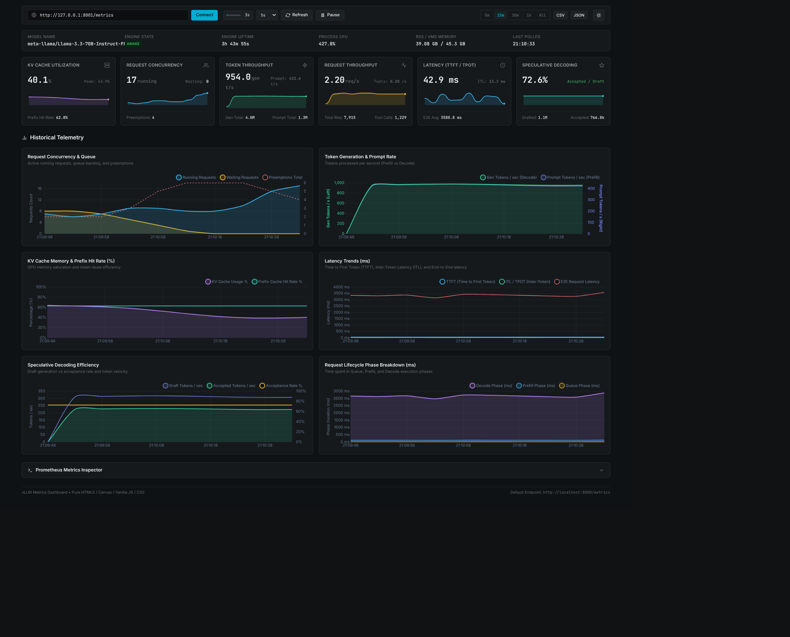

# vLLM Telemetry Dashboard

A lightweight, zero-build, single-page observability dashboard for [vLLM](https://github.com/vllm-project/vllm) inference engine instances. Built with plain HTML5, modern Vanilla CSS (OKLCH color system), and framework-free JavaScript.



## Features

- **Any Metrics Endpoint**: Point it at a vLLM Prometheus endpoint (defaults to `http://localhost:8000/metrics`). The URL is editable in the UI and remembered in `localStorage`.
- **Configurable Auto Refresh**: Linear countdown bar with a 10s default polling cycle, selectable intervals (5s, 10s, 15s, 30s, 60s), plus instant manual refresh and pause/resume.
- **Real-Time KPI Cards & Sparklines**:
  - **KV Cache Utilization %** & peak tracker
  - **Request Concurrency**: Running, Waiting, and Preemptions
  - **Token Throughput**: Generation tok/s (decode), Prompt tok/s (prefill), Generated Total, Prompt Total, and Combined Total
  - **Request & Tool Throughput**: Request rate (req/s), tool call rate (call/s), Total Requests, and Tool Calls Total
  - **Latency Metrics**: Time to First Token (TTFT), Inter-Token Latency (ITL / TPOT), and End-to-End Latency
  - **Speculative Decoding**: Acceptance Rate %, Drafted vs. Accepted token velocity
- **6 Historical Graphs**:
  1. Request Concurrency & Queue Dynamics
  2. Token Generation & Prompt Throughput Rates (dual Y-axes: decode left, prefill right)
  3. KV Cache Saturation & Prefix Cache Hit Rate (%)
  4. Latency Evolution (TTFT, ITL, E2E in ms)
  5. Speculative Decoding Efficiency (Draft vs Accepted tok/s)
  6. Request Phase Duration Breakdown (Prefill, Decode, Queue)
- **Time Range Selector**: Filter history by `5m`, `15m`, `30m`, `1h`, or `All`.
- **Data Export**: One-click export of the recorded history to CSV or JSON.
- **Prometheus Metrics Inspector**: Live searchable, filterable table of every parsed metric, label set, and value.
- **Theme Support**: Dark (default) and Light mode, with a persisted preference.

## Requirements

- A modern browser (Chromium, Firefox, or Safari — desktop recommended).
- A running vLLM instance exposing its Prometheus endpoint (`/metrics`).

## How to Run

### Option 1: Local HTTP Server (recommended)

```bash
python3 -m http.server 3000
```

Then open [http://localhost:3000](http://localhost:3000) in your browser.

### Option 2: Direct File

Open `index.html` directly in any modern browser:

```bash
# Linux
xdg-open index.html

# macOS
open index.html
```

## Usage

1. Enter the Prometheus endpoint of your vLLM server, e.g. `http://localhost:8000/metrics`.
2. Press **Connect** — the first poll happens immediately, then the countdown restarts on the selected interval.
3. Use the time-window buttons to change the visible history, and **CSV** / **JSON** to export what has been recorded.
4. Click the **Prometheus Metrics Inspector** header to browse raw parsed metrics.

## Troubleshooting

- **No data / "Unable to reach metrics endpoint"**: verify the URL is reachable from your browser, that `--port` maps to the intended server, and that the request is not blocked by CORS. Serving the dashboard over `http://localhost` (Option 1) avoids most `file://` origin issues.
- **Metrics show `0`**: some values are per-poll deltas (tokens/s, req/s, CPU %). They appear after the second poll, so wait one interval.

## File Structure

- `index.html`: Single-page layout containing the header controls, system ribbon, KPI cards, charts grid, and metrics inspector.
- `css/styles.css`: CSS styling with OKLCH color tokens, 4px grid rhythm, responsive flex/grid layouts, and light/dark theme variables.
- `js/parser.js`: Prometheus text exposition parser (extracts gauges, counters, histograms, buckets, labels).
- `js/metrics.js`: Metrics store & time-series calculator (computes deltas, rates per second, moving averages, and exports).
- `js/charts.js`: Chart.js configuration & SVG sparkline renderer.
- `js/app.js`: Application lifecycle, polling loop, and event bindings.
- `vendor/chart.umd.min.js`: Local standalone Chart.js 4.4.7 bundle (MIT), with CDN fallback.

## License

Released under the [MIT License](LICENSE). Chart.js is bundled under its own MIT license.
